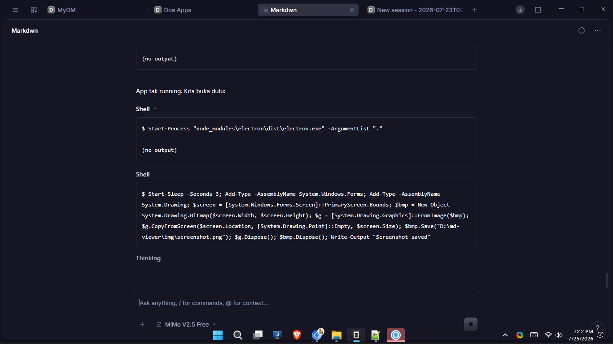

# Markdown Viewer

A desktop markdown editor and viewer built with Electron.



## Features

- View and edit `.md` / `.markdown` files
- Drag & drop folders to browse markdown files
- Folder sidebar with file list and tree view
- Dark / Light theme
- Search files and find text in page (Ctrl+F)
- Table of contents auto-generated from headings
- Code blocks with copy button
- Image lightbox viewer
- Font size controls
- Reading progress bar
- Print to PDF (Ctrl+P)

## Keyboard Shortcuts

| Shortcut | Action |
|----------|--------|
| Ctrl+O | Open markdown file |
| Ctrl+K | Open folder |
| Ctrl+S | Save (edit mode) |
| Ctrl+F | Find in page |
| Ctrl+P | Print / PDF |
| Escape | Close find bar / lightbox |

## Install

Download `MarkdownViewer-1.3.0-setup.exe` and run the installer.

## Development

```bash
npm install
npm start
```

## Build

```bash
npm run build          # NSIS installer
npm run build:portable # Portable EXE
```

## Tech Stack

- Electron 33
- Marked (markdown parser)
- electron-builder (packaging)
